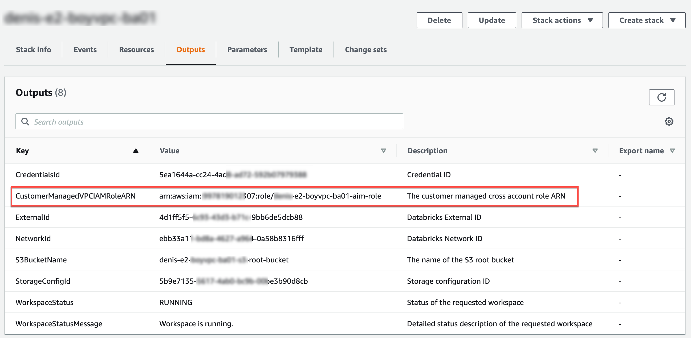

[start=10]
. Above screenshot shows the outputs when deploying Multi-workspace configured with a Databricks managed VPC with an optional customer-managed key for Notebooks.

. Below screenshot shows the outputs when deploying Multi-workspace configured with a customer-managed VPC with an optional customer-managed key for Notebooks.

[#cfn_outputs_cmvpc]
.{partner-product-name} Multi-workspace with customer-managed VPC outputs after successful deployment

// Add steps as necessary for accessing the software, post-configuration, and testing. Don’t include full usage instructions for your software, but add links to your product documentation for that information.
//Should any sections not be applicable, remove them

//== Test the deployment
// If steps are required to test the deployment, add them here. If not, remove the heading

== Post deployment steps
// If Post-deployment steps are required, add them here. If not, remove the heading
Upon a CREATE_COMPLETE CloudFormation Stack, check the WorkspaceStatus output key value to ensure that it is RUNNING. Then, navigate to the workspace deployment name URL <deployment-name>.cloud.databricks.com and log in to the web application with your multi-workspace master account username and password.

For any other WorkspaceStatus value other than RUNNING, See https://docs.databricks.com/administration-guide/multiworkspace/new-workspace-aws.html#troubleshoot-a-workspace-that-failed-to-deploy[Troubleshoot a workspace that failed to deploy^] for how to handle unsuccessful status values.

//== Best practices for using {partner-product-name} on AWS
// Provide post-deployment best practices for using the technology on AWS, including considerations such as migrating data, backups, ensuring high performance, high availability, etc. Link to software documentation for detailed information.

//_Add any best practices for using the software._

//== Security
// Provide post-deployment best practices for using the technology on AWS, including considerations such as migrating data, backups, ensuring high performance, high availability, etc. Link to software documentation for detailed information.

//_Add any security-related information._

//== Other useful information
//Provide any other information of interest to users, especially focusing on areas where AWS or cloud usage differs from on-premises usage.

//_Add any other details that will help the customer use the software on AWS._