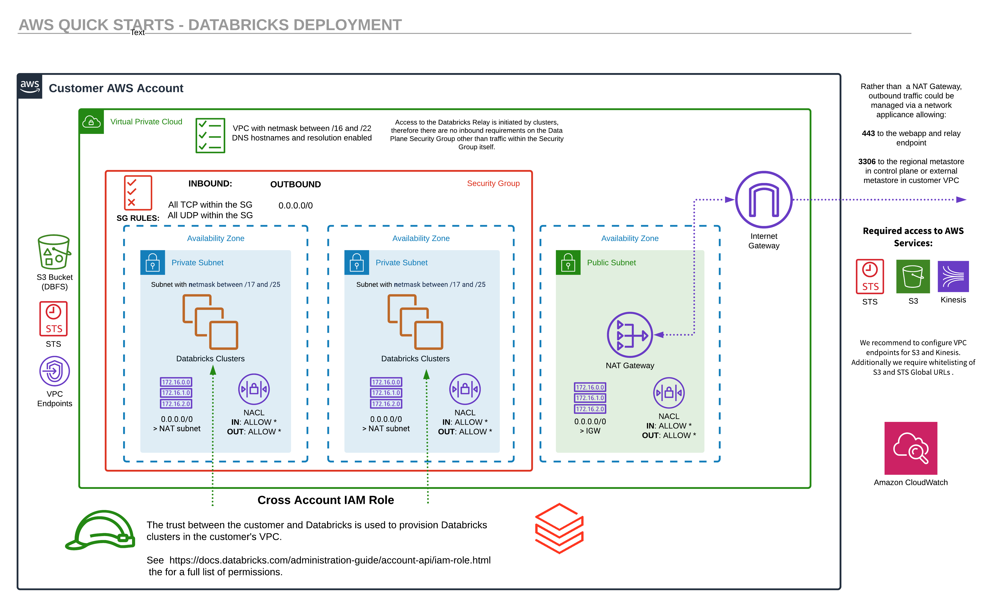

This Quick Start allows 2 deployment options to choose from - Databricks managed VPC and Customer managed VPC deployment. 

Following diagram shows all the components deployed by the Quick Start. Some resources will be created depending upon the chosen deployment option, when launching the CloudFormation template.

[#architecture1]
.Quick Start architecture Databricks on AWS
[link=images/architecture_databricks_managed.png]

As shown in Figure 1, this deployment sets up the following:

* A highly available architecture that spans multiple Availability Zones.
* A VPC configured with public subnets according to AWS best practices, to provide you with your own virtual network on AWS.**
* A cross-account IAM role, so that Databricks can deploy clusters in the appropriate VPC for the new workspace.
* An S3 bucket required to store objects like cluster logs, notebook revisions, and job results.
* A Databricks workspace.
* A customer-managed AWS KMS key to encrypt notebooks in the control plane.*
* Security groups to enable secure cluster connectivity.

*The components marked by asterisks are created when KMS Key Id is provided.

**The components marked by double asterisks are created when VPCID isn't provided.