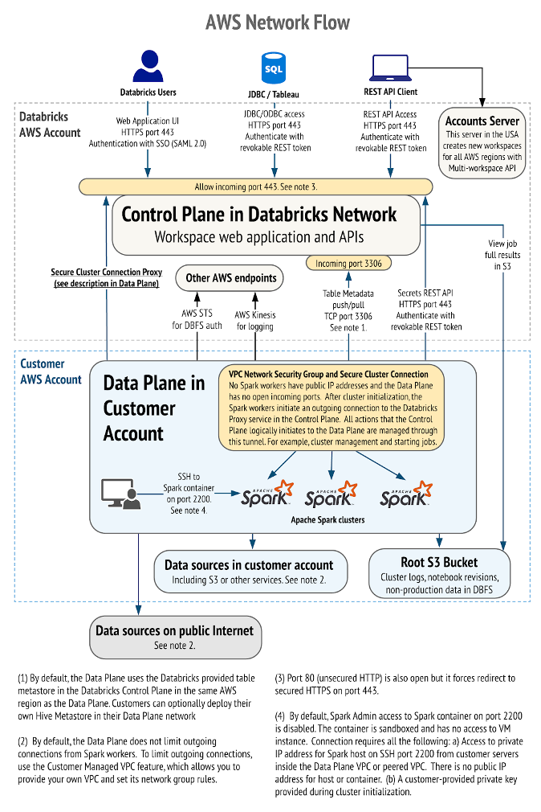

// Replace the content in <>
// Briefly describe the software. Use consistent and clear branding. 
// Include the benefits of using the software on AWS, and provide details on usage scenarios.
:xrefstyle: short

Using the Databricks platform, cross-functional teams can collaborate securely. You can stay focused on your data science, data analytics, and data engineering tasks while Databricks manages many of the backend services. 

All Databricks architectures have two planes:

* The *control plane* includes the backend services that Databricks manages in its AWS account. 

* The *data plane*, which your AWS account manages, is where your data resides and is processed. You can ingest data from external data sources (sources outside of your AWS account) such as events data, streaming data, and Internet of Things (IoT) data. You can also connect to external data sources for storage by using Databricks connectors. Because your data resides in your AWS account in the data plane, you control and own it without lock-in.

=== Databricks AWS control plane

This section describes the overall network architecture and details about control-plane security.

==== Network access

The Databricks platform follows best practices for securing network access to cloud applications. 

[#networkflow]
.AWS network flow with Databricks
[link=images/network-flow.png]

The AWS network flow with Databricks, as shown in <<networkflow>>, includes the following:

* *Restricted port access to the control plane.*
** Port 443 is the main port open for data connections to the control plane. Connections on that port are protected by Transport Layer Security (TLS) connections. The TLS certificate is stored in Hashicorp Vault in the control plane. The TLS certificate is installed as a Kubernetes secret.
** Port 80 is open only for redirects to HTTPS on port 443.
** A security group protects individual control-plane hosts from the external internet except inbound ports to the load balancer, which dispatches web application and API requests to the appropriate internal services.
** Port 3306 is open for access to the table metastore (on a separate IP address) and may be deployed in a separate peered virtual private cloud (VPC). Customers may deploy their own table metastores, in which case they would not use the provided table metastore. See https://docs.databricks.com/data/metastores/index.html#metastores[Metastores^].

* *IP access limits for web application and REST API (optional).* You can limit access to the Databricks web application and REST API by requiring specific IP addresses or ranges. For example, specify the IP addresses for the customer corporate intranet and VPN. This reduces risk from several types of attacks. This feature requires the Enterprise tier.

=== Databricks AWS data plane

Apache Spark clusters and their data stores are deployed in a customer-controlled AWS account. A Databricks customer deployment is generally isolated at the AWS-account level, but you can deploy multiple workspaces in a single AWS account. No other Databricks customers have access to your data plane in AWS. 

By default, clusters are created in a single VPC that Databricks creates and configures. This means that the Databricks platform requires AWS permissions in the control plane to create a new VPC in your account for the data plane. This includes creating new security groups and configuring subnets.

If you use the customer-managed VPC feature, you can specify your own VPC in your customer account, and Databricks launches clusters in that VPC. This feature requires the Premium or higher tier.

=== S3 bucket in the customer account

During workspace creation, an Amazon Simple Storage Service (Amazon S3) bucket is created in the customer account. It provides Databricks access to the managed S3 bucket with a cross-account AWS Identity and Access Management (IAM) role. IAM roles allow customers to access data from Databricks clusters without having to embed AWS keys in notebooks.

IMPORTANT: The customer is responsible for backing up, securing access to, and encrypting customer data in the S3 bucket. Databricks is not responsible for backups of this data or any other customer data and thus cannot give a copy of this data to customers if requested.

The Databricks workspace uses this bucket to store some input or output data. It accesses this data in two ways:

* *Databricks-managed directories.* These directories are inaccessible to customers using Databricks File System (DBFS). Some data—for example, Spark driver log initial storage and job output—is stored or read by Databricks in hidden directories. This data cannot be accessed directly by customer notebooks at a DBFS path or through the AWS admin interface. 
* *DBFS root storage.* This is accessible to customers using DBFS. Other areas of storage can be accessed by customer notebooks at a DBFS path. For example, the FileStore area of DBFS root storage is where uploaded data files and code libraries are stored when imported using the web application. Other DBFS paths are available for customer usage.

IMPORTANT: The DBFS root storage is available for nonproduction customer data, such as simple uploads for testing. DBFS root storage is not intended as a storage location for production customer data. Instead, for storage of production customer data, use additional customer-managed data sources of many types. Customers can optionally use Databricks API operations to create additional DBFS mount points for additional S3 buckets.

The data plane uses the AWS Security Token Service (AWS STS) to manage DBFS credentials to Amazon S3.

=== Multiworkspace environment configurations

This Quick Start provides the following three configuration options:

* Create a multiworkspace environment configured with a Databricks-managed VPC.
* Create a multiworkspace environment configured with a Databricks-managed VPC with an optional customer-managed key for notebooks. 
* Create a multiworkspace environment configured with an optional customer-managed key for notebooks and an optional existing customer-managed VPC.

The Quick Start provides different parameters in the main template for these options.