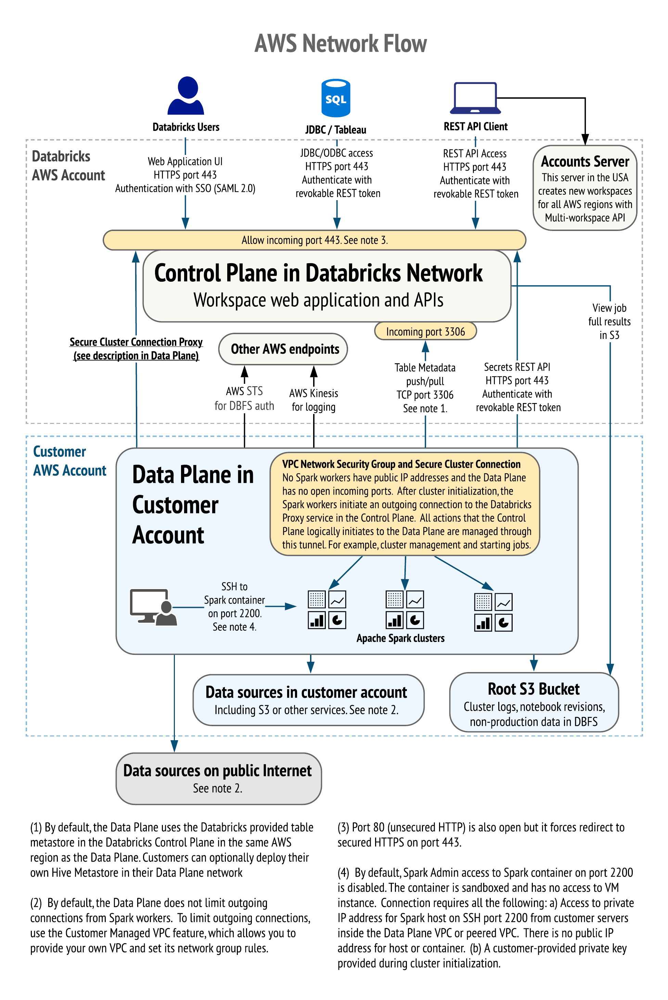

// Replace the content in <>
// Briefly describe the software. Use consistent and clear branding. 
// Include the benefits of using the software on AWS, and provide details on usage scenarios.
:xrefstyle: short

The Databricks platform helps cross-functional teams communicate securely. You can stay focused on data science, data analytics, and data engineering tasks while Databricks manages many of the backend services. 

All Databricks architectures have two planes:
* The control plane includes backend services that Databricks manages in its AWS account. 
* The data plane, which your AWS account manages, is where your data resides and is processed. You can ingest data from external data sources (that is, sources outside of your AWS account), such as events, streaming, and Internet of Things (IoT). You can also connect to external data sources for storage by using Databricks connectors. Because your data resides in your AWS account in the data plane, you control it.

=== Databricks AWS control plane

This section describes the overall network architecture and details about control-plane security.

==== Network access

The Databricks platform follows best practices for securing network access to cloud applications. 

[#networkflow]
.AWS network flow with Databricks
[link=images/network_flow.png]

The AWS network flow with Databricks, as shown in <<networkflow>>, includes the following:

* Restricted port access to the control plane.
** Port 443 is the main port for data connections to the control plane. Connections on this port are protected by Transport Layer Security (TLS). The TLS certificate is stored in Hashicorp Vault in the control plane. The TLS certificate is installed as a Kubernetes secret.
** Port 80 is open only for redirects to HTTPS on port 443.
** Except for the inbound ports to the load balancer, a security group protects individual control-plane hosts from the external internet and invokes web-application and API requests to the appropriate services.
** Port 3306 is open for access to the table metastore (on a separate IP address) and may be deployed in a separate, peered virtual private cloud (VPC). Customers may deploy their own table metastores, in which case they would not use the provided table metastore. For more information, see https://docs.databricks.com/data/metastores/index.html#metastores[Metastores^].

* *(Optional) IP access limits for web application and REST API.* You can limit access to the Databricks web application and REST API by requiring specific IP addresses or ranges. For example, specify the IP addresses for the customer's corporate intranet and VPN. This feature requires the Enterprise tier and reduces the risk of malicious attacks.

=== Databricks AWS data plane

Apache Spark clusters and their data stores deploy in a customer-controlled AWS account. A Databricks customer deployment is generally isolated at the AWS account level, but you can deploy multiple workspaces in a single AWS account. No other Databricks customers can access your data plane on AWS. 

By default, clusters are created in a single VPC that Databricks creates and configures. This means that the Databricks platform requires AWS permissions in the control plane to create a new VPC in your account for the data plane. This includes creating new security groups and configuring subnets.

If you use the customer managed VPC feature, you can specify your own VPC in your customer account, and Databricks launches clusters in that VPC. This feature requires the premium or higher tier.

=== S3 bucket in the customer account

An Amazon Simple Storage Service (Amazon S3) bucket is created in the customer account with default encryption and bucket-versioning enabled. Amazon S3 blocks all public access and, using a lifecycle management rule, permanently deletes versions after five days.

IMPORTANT: Customers are responsible for backing up, securing, and encrypting customer data in the S3 bucket. Databricks is not responsible for data backups or any other customer data. This prevents Databricks from providing copies of data to unauthorized customers.

The Databricks workspace uses the S3 bucket to store some input and output data. It accesses this data in two ways:

* *Databricks-managed directories.* These directories are inaccessible to customers using Databricks File System (DBFS). Some data (for example, Spark driver log initial storage and job output) is stored or read by Databricks in hidden directories. This data cannot be accessed directly by customer notebooks through a DBFS path or AWS administrator interface. 

* *DBFS root storage.* This is accessible to customers using DBFS. Other areas of storage can be accessed by customer notebooks through a DBFS path. For example, the FileStore area of DBFS root storage is where uploaded data files and code libraries are stored when imported using the web application. Other DBFS paths are available for customer usage.

IMPORTANT: The DBFS root storage is available for nonproduction customer data, such as uploads for testing. DBFS root storage is not intended as a storage location for production data. For production storage, use additional customer managed data sources of various types. Optionally, customers can use Databricks API operations to create more DBFS mount points for additional S3 buckets.

The data plane uses the AWS Security Token Service (AWS STS) to manage DBFS credentials on Amazon S3.

=== Workspace configurations

For both deployment options, this Quick Start creates one of the following configurations:

* A workspace configured with a Databricks-managed VPC.
* A workspace configured with a Databricks-managed VPC with an optional customer managed key for notebooks. 
* A workspace configured with a customer managed VPC with an optional customer managed key for notebooks.
